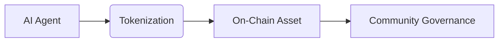

# Introduction

In the era of digital transformation, ASSETRA’s mission is to revolutionize how **intelligence** is valued and exchanged by enabling the **tokenization of AI agents** and digital optimization tools as Real-World Assets (RWAs). By harnessing blockchain technology, ASSETRA empowers stakeholders to treat autonomous algorithms—from chatbots to predictive engines—as **investable**, **tradable**, and **governable** on-chain entities.

Key value propositions include:

- **Investable Assets:** AI systems gain financial representation, unlocking liquidity and new markets for digital innovation.  
- **On-Chain Intelligence:** Each tokenized agent carries verifiable metadata—performance metrics, ownership history, and revenue models—ensuring transparency and trust.  
- **Community Co-Ownership:** Through token-based governance, communities can collaboratively manage, fund, and scale high-value AI-driven solutions.

This paradigm shift redefines digital ownership, allowing founders to raise capital directly against algorithmic performance and enabling enterprises to democratize access to productivity tools. ASSETRA bridges the gap between autonomous digital workflows and traditional finance, laying the foundation for a new asset class where code meets capital.

With ASSETRA, developers can seamlessly mint tokens representing AI workflows, investors gain diversified exposure to algorithmic performance, and enterprises unlock new revenue models by fractionalizing digital services. This documentation will guide you through the conceptual foundations, technological architecture, use cases, and tokenomics driving the ASSETRA ecosystem.

