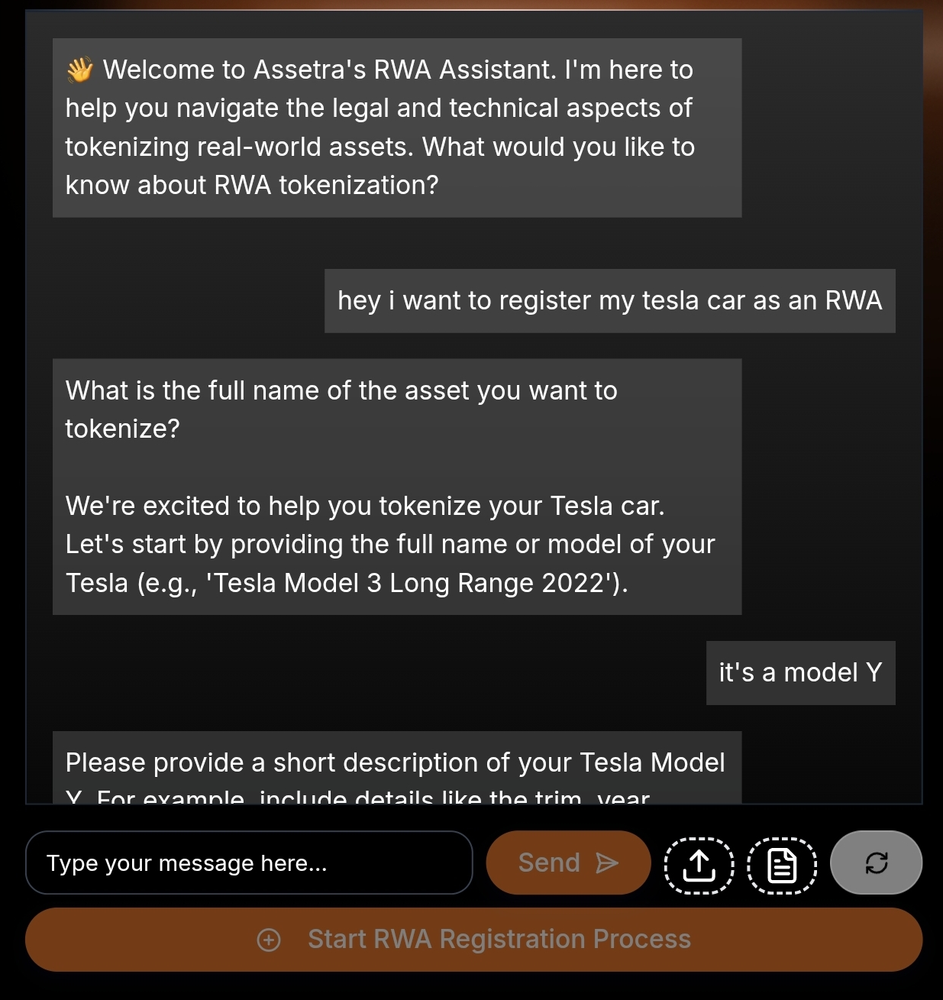

# AI Assistant

<figure><figcaption></figcaption></figure>

ASSETRA’s AI assistant is integral to the platform, enhancing efficiency, security, and accessibility. The AI performs critical tasks, making ASSETRA user-friendly for those without blockchain expertise. It verifies assets by analyzing ownership documents, legal titles, and market data, detecting fraud or discrepancies within 24–48 hours. This ensures only legitimate assets are tokenized, building trust. The AI also automates token creation, generating smart contracts with customizable parameters like token supply, royalty rates, and lock periods, tailored to market trends. Additionally, it provides real-time analytics, offering insights into asset performance, trading trends, and investment opportunities, empowering informed decisions.

The AI enhances security by monitoring transactions for suspicious activity and ensuring regulatory compliance. Its intuitive interface guides users through asset uploads, token setup, and marketplace listings, eliminating technical barriers. As one user stated, “The AI-powered verification process gave us confidence in tokenizing our intellectual property, streamlining a complex process into a few clicks” (Guillermo Malo de Molina, Innovation Smart District). By automating complex processes and delivering actionable insights, ASSETRA’s AI assistant makes tokenization and trading seamless, secure, and accessible. Explore this feature at assetrarwa.com.
