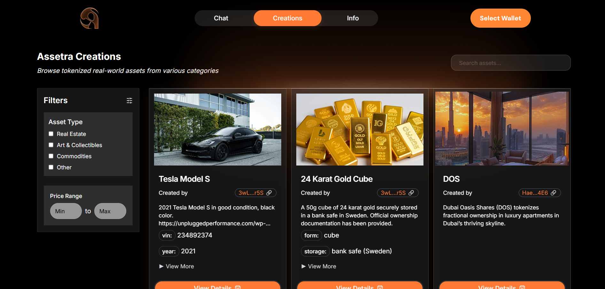

# Decentralized Marketplace

<figure><figcaption></figcaption></figure>

Trading tokenized assets occurs on a decentralized marketplace built on Solana’s high-speed blockchain, offering transparency and efficiency. Users can browse, purchase, or sell tokens representing real estate, art, or intellectual property, with pricing and transaction histories publicly recorded. The marketplace supports diverse trading options, including outright purchases, fractional ownership, and leasing arrangements (e.g., rental income or air rights), catering to varied investment strategies. Solana’s near-instant finality ensures rapid settlements, while low fees (0.3–0.5%) maintain affordability.\
\
Accessible globally to retail and institutional investors, the marketplace features a user-friendly interface for filtering assets by category, price, or yield. Promotional tools allow asset owners to highlight unique features, such as a property’s prime location or an artwork’s historical significance, attracting buyers worldwide. As one testimonial highlights, “The platform has redefined how we approach asset management, making it seamless and inclusive for creators and investors alike” (Anonymous Client). This dynamic trading environment unlocks asset value in a decentralized, transparent manner. Discover trading opportunities at [assetrarwa.com](https://assetrarwa.com).
