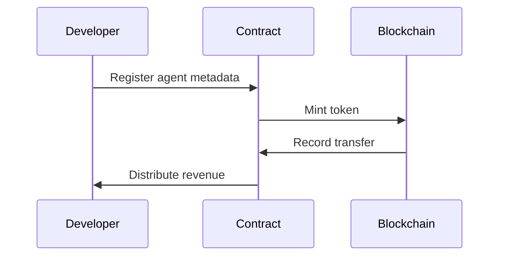

# Technology

## Blockchain Integration

ASSETRA is built for EVM-compatible chains such as Ethereum, Polygon, and BNB Smart Chain, ensuring seamless integration with existing DeFi ecosystems. Developers deploy token and governance contracts to their preferred network, leveraging layer-2 solutions for cost efficiency and high throughput. Onboarding modules handle network selection, gas optimization, and oracle integrations. By abstracting chain-specific details into a unified SDK, ASSETRA accelerates developer workflows and lowers barriers to entry for tokenizing AI assets.

## Smart Contract Mechanics

At its core, ASSETRA utilizes modular smart contracts to manage agent registration, token minting, and revenue distribution. **Registration contracts** verify agent metadata, link off-chain repositories, and issue unique token IDs. **Token contracts** implement ERC-20/ERC-721 standards with extensions for royalty enforcement and profit-sharing. **Revenue-split contracts** automatically distribute fees to token holders based on predefined percentages or dynamic governance decisions. This orchestration is governed by on-chain proposals, enabling continuous upgrades and community-driven improvements.

## Security & Compliance

Security is paramount; all contracts undergo rigorous audits by leading firms and are continuously monitored via on-chain alerts. Enterprises can enable **KYC/AML** modules that gate token transfers, ensuring only verified participants engage with high-value assets. Compliance layers support role-based access, upgradeability restrictions, and configurable pause functions to respond to emergent risks. A multi-signature treasury further secures collected funds and fee distributions.

