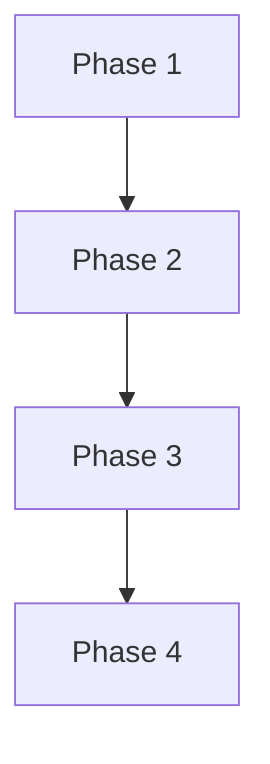

# Tokenomics

## Utility

ASSETRA tokens empower **staking**, **governance**, and **access** to premium AI services. Holders can stake assets to secure network operations, participate in community votes on feature upgrades, and unlock tiered API limits for enterprise-grade tooling. Utility tokens also grant discounted fee schedules and priority in token issuance rounds.

## Distribution & Incentives

To bootstrap ecosystem growth, ASSETRA employs a phased distribution model: initial token sale (20%), developer grants (15%), community incentives (25%), team and advisors (20%), and reserve (20%). Incentive programs reward early adopters through liquidity mining and hackathons. Ongoing staking rewards and token buyback mechanisms ensure sustainable value accrual and align long-term stakeholder interests.

## Roadmap

- **Phase 1:** Platform launch, core smart contracts, and initial token issuance.  
- **Phase 2:** SDK release, oracle integrations, and NFT agent marketplace.  
- **Phase 3:** Enterprise compliance modules, cross-chain support, and mobile dashboard.  
- **Phase 4:** Advanced governance features, revenue-sharing vaults, and global partnerships.

