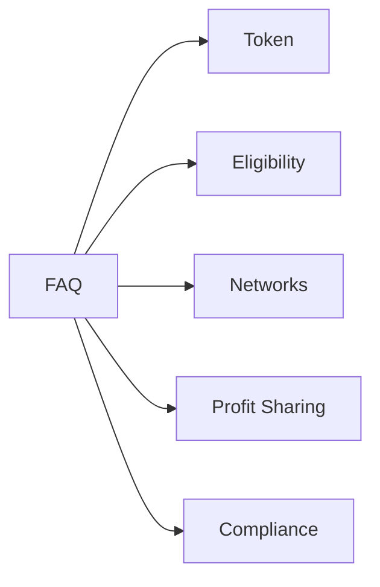

# FAQ

**Q1: What is ASSETRA Token?**  
A1: A digital token representing ownership and governance rights of an AI agent on-chain.

**Q2: How are agents eligible for tokenization?**  
A2: Agents must meet criteria for performance, security audit, and metadata completeness.

**Q3: What blockchain networks are supported?**  
A3: EVM-compatible chains such as Ethereum, Polygon, and BNB Smart Chain.

**Q4: How does profit sharing work?**  
A4: Smart contracts automatically distribute fees to token holders based on defined percentages.

**Q5: Can enterprises enforce compliance?**  
A5: Yes, optional KYC/AML modules can be enabled for regulated environments.

**Q6: What governance models are available?**  
A6: Token-based voting, DAO proposal systems, and multi-signature treasury controls.

**Q7: How is token supply managed?**  
A7: Supply is governed by smart contracts with minting caps and vesting schedules.

**Q8: What are the incentives for early adopters?**  
A8: Liquidity mining rewards, grant allocations, and exclusive token sale access.

**Q9: Is the platform audited?**  
A9: Yes, all core contracts undergo third-party security audits monthly.

**Q10: Where can I find developer resources?**  
A10: Visit the Developer Guide and API reference sections in this documentation.

