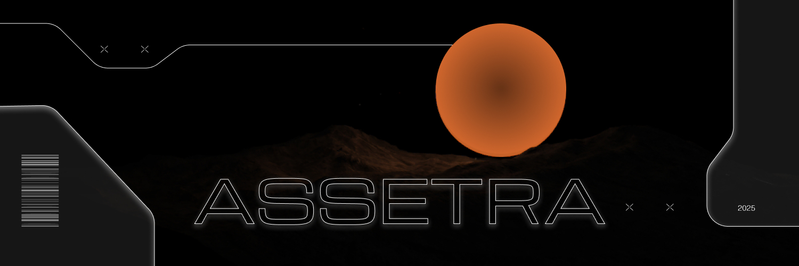

# Introduction

<figure><figcaption></figcaption></figure>

Welcome to the official GitBook documentation for ASSETRA, a transformative platform built on the Solana blockchain to tokenize real-world assets (RWAs) like real estate, art, and intellectual property. ASSETRA democratizes investment through fractional ownership, AI-driven automation, and a decentralized marketplace, making high-value assets accessible to everyone. \
\
This guide offers a detailed overview of ASSETRA’s features, onboarding process, tokenomics, security, and practical use cases, designed for both beginners and experts. No technical expertise is needed, thanks to ASSETRA’s intuitive interface and AI assistance. Developed by a multidisciplinary team of over 12 experts in blockchain, AI, finance, and legal compliance, ASSETRA is redefining asset ownership.

## Subsections

* [1.1 The Paradigm Shift](1.1-The-Paradigm-Shift.md)
* [1.2 About the Project](1.2-About-the-Project.md)
* [1.3 Why Solana?](1.3-Why-Solana.md)
